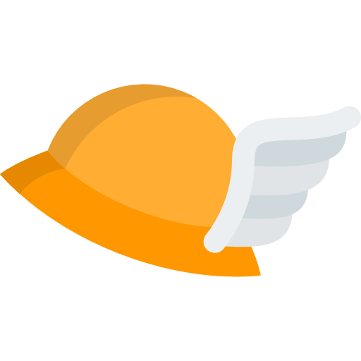

# Hermes 
Hermes is a crypto platform to test and run trading algorithms.

## Main features
Under development.

## Quickstart
Under development.

## Documentation
Under development.

## Contact
Any questions or suggestions feel free to contact me at federicoagustincaccia@gmail.com

## Licensing
Copyright (C) 2018 Federico A. Caccia

Hermes is free software: you can redistribute it and/or modify
it under the terms of the GNU General Public License as published by the Free Software Foundation, either version 3 of the License, or (at your option) any later version.

Hermes is distributed in the hope that it will be useful,
but WITHOUT ANY WARRANTY; without even the implied warranty of
MERCHANTABILITY or FITNESS FOR A PARTICULAR PURPOSE.  See the
GNU General Public License for more details.

You should have received a copy of the GNU General Public License
along with Hermes.  If not, see <http://www.gnu.org/licenses/>.

### Icon licensing

Icon made by <a href="http://www.freepik.com" title="Freepik">Freepik</a> from <a href="https://www.flaticon.com/" title="Flaticon">www.flaticon.com</a> is licensed by <a href="http://creativecommons.org/licenses/by/3.0/" title="Creative Commons BY 3.0" target="_blank">CC 3.0 BY</a>
